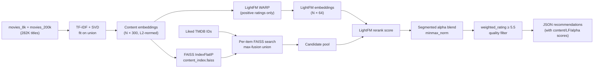

# Pickflix Movie Recommender Backend

A hybrid content + collaborative-filtering movie discovery API built around the multi-signal recommender. Turns a small set of liked movie IDs into fast, quality-filtered recommendations across a ~282K-movie catalog — with no user accounts or stored profiles.

## Overview

Pickflix is a Python/FastAPI backend for movie browsing, title search, metadata lookup, and personalised recommendations. The v2.2 AI pipeline is a two-stage retrieve-then-rerank system:

1. **Content-FAISS retrieval** — embeddings covering all 282K movies surface a candidate pool for any title, including those with no user ratings.
2. **LightFM collaborative reranking** — a per-candidate segmented alpha blends content similarity with collaborative signal. Movies with real rating interactions lean toward LightFM; cold-start items (no real ratings) lean toward content to avoid trusting un-validated embeddings.
3. **IMDB weighted-rating quality filter** — drops low-quality candidates before returning results.

Because the request carries only TMDB IDs (not a user identity), recommendations are generated without persisting any user data.

## Key Features

- **Hybrid recommender** — content-FAISS retrieval + LightFM rerank with per-candidate segmented alpha (`ALPHA_WARM` / `ALPHA_COLD`).
- **282K-movie catalog** — covers both the 8K rated catalog and 200K cold-start titles in one unified embedding space.
- **IMDB weighted-rating quality gate** — uniform quality signal computed on the full catalog union.
- **Anonymous personalisation** — recommendation context comes from liked TMDB IDs in the request; nothing is stored.
- **Multi-query max-fusion FAISS retrieval** — each liked movie independently queries the index; candidates are merged by best score.
- **Segmented alpha** — `ALPHA_WARM = 0.1` (more LightFM weight) for 8K movies with real interactions; `ALPHA_COLD = 0.8` (content-heavy) for 200K cold-start movies.
- **Discovery endpoint** — random sample of high-quality movies, filterable by language and release year.
- **High-recall fuzzy search** — token overlap + RapidFuzz partial-ratio + popularity + exact/prefix boosts.
- **Stateless pagination** — a session key keeps a shuffled catalog order reproducible across requests.
- **Graceful LightFM degradation** — if LightFM artifacts are absent, the system falls back to content-only scoring automatically.
- **FastAPI auto-docs** and per-request timing logs.

## Tech Stack

| Layer | Libraries |
|---|---|
| API | FastAPI, Pydantic v2, Uvicorn, Starlette |
| Recommendation engine | FAISS (`IndexFlatIP`), NumPy, LightFM |
| Data processing | pandas, PyArrow, scikit-learn, SciPy |
| Search | RapidFuzz |
| Research / training | Jupyter, TF-IDF, TruncatedSVD, StandardScaler |

## How It Works

### Content embeddings (300 dimensions)

The notebook fits TF-IDF → SVD on the **union** of both catalogs so vocabulary and SVD directions reflect all 282K movies:

| Signal channel | Dimensions | Weight | Role |
|---|---:|---:|---|
| Overview | 120 | 1.5 | Plot and thematic similarity |
| Genres + keywords | 50 | 1.2 | Broad category and themes |
| Cast, directors, writers | 80 | 1.0 | Talent and creator preferences |
| Title (char n-grams) | 40 | 0.6 | Franchise and title patterns |
| Original language | 2 | 1.4 | Language preference and separation |
| Numeric (vote_avg, WR, revenue, runtime, popularity, year, decade) | 8 | 1.8 | Quality, confidence, popularity, release era |

Channels are concatenated and L2-normalised → `all_content_embeddings.npy`.

> **Cold-start design** — `avg_rating` / `bayesian_rating` (8K-only) are excluded from the shared numeric channel so 200K cold-start movies never receive a fake imputed constant.

### LightFM collaborative layer (64 dimensions)

LightFM is trained with WARP loss on **positive-only** (`rating ≥ 4.0`) interactions from `ratings.csv`. It receives the content embeddings as item features, so calling `get_item_representations()` on any of the 282K movies produces a collaborative-aware embedding — but for cold-start items this is pure feature-space extrapolation with no real interaction validation, which is why `ALPHA_COLD` keeps content dominant for those items.

### Hybrid blend (per-candidate)

```
blended[i] = alpha[i] × minmax(content[i]) + (1 − alpha[i]) × minmax(lightfm[i])
```

Both signals are normalised with the same per-query `minmax_norm()` used in the notebook evaluation, so `alpha` means the same thing in production and in every evaluation harness.

### Pipeline diagram



### Recommendation decision flow

1. Map liked TMDB IDs → row positions in the catalog (== FAISS positions).
2. For each liked movie, search the content FAISS index for `per_item_k` neighbours; merge by max-score into a candidate pool.
3. Compute LightFM blended scores with segmented alpha, using `minmax_norm()` on both signals.
4. Sort by blended score; walk the ranked list applying the quality gate (`weighted_rating ≥ 5.5`) and optional language / era filters.
5. Return up to `k` results with metadata, content score, LightFM score, alpha used, and blended score.


## Frontend Repo: https://github.com/sudo-muneeb/pickflix-movie-recommender-frontend

## Getting Started

### Prerequisites

- Python 3.10+
- The following artifacts in `artifacts/` (generated by the notebook, section 21):

```text
artifacts/
├── all_movies.parquet             # 282K-movie catalog with has_real_ratings, weighted_rating, …
├── all_content_embeddings.npy    # (N, 300) L2-normalised content matrix
├── content_index.faiss           # FAISS IndexFlatIP
├── lightfm_item_embeddings.npy   # (N, 64) LightFM production embeddings  ← optional
├── lightfm_item_biases.npy       # (N,) LightFM item biases                ← optional
└── blend_config.json             # ALPHA_WARM, ALPHA_COLD, PRODUCTION_MIN_WR, LIKE_THRESHOLD
```

> If the LightFM `.npy` files are absent, the server starts in **content-only mode** automatically — no code change needed.

### Install and run

```bash
python3 -m venv .venv
source .venv/bin/activate
pip install -r requirements.txt
uvicorn main:app --reload --port 8000
```

The server loads all artifacts at startup. Interactive API docs are at <http://localhost:8000/docs>.

## Usage

**Liveness check:**
```bash
curl http://localhost:8000/health
```
Returns `lightfm_on`, `alpha_warm`, `alpha_cold`, `min_wr`, and `movies_loaded`.

**Browse high-quality movies:**
```bash
curl 'http://localhost:8000/movies/default?lang=en&page_offset=0'
```
Use the returned `pagination_key` on subsequent pages to preserve the session's shuffle order.

**Discover movies by language / era:**
```bash
curl 'http://localhost:8000/movies/discover?language=ko&year_from=2010&year_to=2024&min_weighted_rating=7.0&n=20'
```

**Search by title:**
```bash
curl 'http://localhost:8000/movies/search?q=parasite'
```

**Get personalised recommendations:**
```bash
curl -X POST http://localhost:8000/recommend \
  -H 'Content-Type: application/json' \
  -d '{
    "liked_indices": [496243, 372058],
    "exclude_indices": [496243, 372058],
    "k": 20,
    "min_weighted_rating": 5.5,
    "same_language": false,
    "same_era": false
  }'
```

Each recommended movie includes `content_score`, `lightfm_score`, `alpha_used`, `blended_score`, and `source` (`"8k"` or `"200k"`).

**Full movie metadata:**
```bash
curl http://localhost:8000/movies/496243
```

## API Reference

| Method | Endpoint | Purpose |
|---|---|---|
| `GET` | `/health` | Liveness probe — returns version, catalog size, LightFM status, and blend constants |
| `GET` | `/movies/default` | Paginated high-quality movies, shuffled per session (`lang`, `page_offset`, `pagination_key`) |
| `POST` | `/recommend` | Hybrid personalised recommendations from liked TMDB IDs |
| `GET` | `/movies/search?q=…` | Fuzzy title search, up to 25 results |
| `GET` | `/movies/discover` | Random sample of high-rated movies (`language`, `year_from`, `year_to`, `min_weighted_rating`, `seed`, `n`) |
| `GET` | `/movies/{movie_index}` | Full metadata for a TMDB ID |

### `POST /recommend` — request body

| Field | Type | Default | Description |
|---|---|---|---|
| `liked_indices` | `int[]` | required | TMDB IDs of liked movies (≥ 1) |
| `exclude_indices` | `int[]` | `[]` | TMDB IDs to suppress from results |
| `k` | `int` | `20` | Number of results to return |
| `min_weighted_rating` | `float` | `5.5` | IMDB weighted-rating quality threshold |
| `same_language` | `bool` | `false` | Restrict to input languages |
| `same_era` | `bool` | `false` | Restrict to ± `era_window` years |
| `era_window` | `int` | `15` | Year radius for `same_era` filter |

## Design Trade-offs

| Trade-off | Choice |
|---|---|
| **Cold-start coverage** | Content embeddings cover all 282K movies; `ALPHA_COLD = 0.8` keeps cold items from being dominated by un-validated LightFM scores |
| **Warm-item quality** | `ALPHA_WARM = 0.1` trusts LightFM more for 8K movies, backed by bootstrap-validated HR@10 sweep in the notebook |
| **Quality vs. recall** | `weighted_rating ≥ 5.5` filter matches production; evaluation harnesses use the same filter (v2.2 fix #5) |
| **Anonymity** | No user accounts or histories are persisted; liked IDs live only in the request |
| **Static artifacts** | Changes to feature weights or source data require rerunning the notebook and rebuilding artifacts |
| **Exact search** | `IndexFlatIP` is exact (not approximate), so result quality is predictable; runtime scales linearly with catalog size and embedding dimension |

## Project Structure

```text
.
├── main.py                      # FastAPI app, routes, CORS, request logging
├── models.py                    # Pydantic v2 request and response schemas
├── recommender.py               # Artifact loading, hybrid pipeline, search, discovery
├── requirements.txt             # Pinned Python dependencies
├── notebooks/
│   └── movie_recommender.ipynb  # v2.2 multi-signal hybrid recommender (training + eval)
└── artifacts/                   # Generated runtime assets (git-ignored)
```

